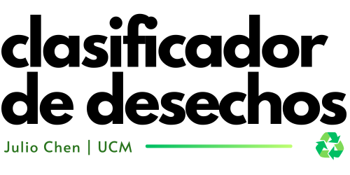

  

# Modelo de Clasificación de Desechos ♻

Hola 👋, en este repositorio les presento mi trabajo final de master (TFM). Se trata de un modelo de Red Neuronal Convolucional (CNN) para clasificar imágenes de desechos en las categorías "orgánico" y "reciclable".

### **🚧⚠️Pronto aquí encontrarán el código⚠️🚧**
